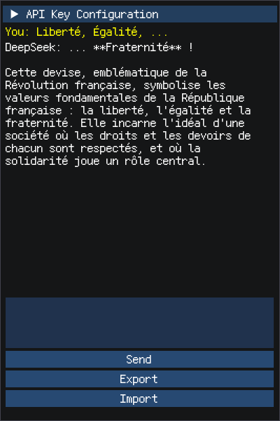

# ds-cpp

A simple deepseek client based on Dear ImGui.



## Build

Clone this repository recursively.

```
git clone https://github.com/fpg2012/ds-cpp --recursive
```

For Linux:

```
cd ds-cpp
mkdir build
cmake .. -DCMAKE_BUILD_TYPE=Release
make
```

For Windows:

Use Visual Studio to open the directory, after cmake configuration, build the solution.
